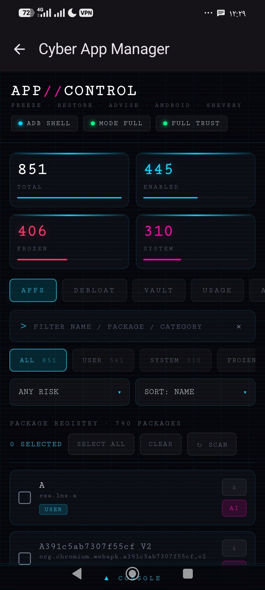
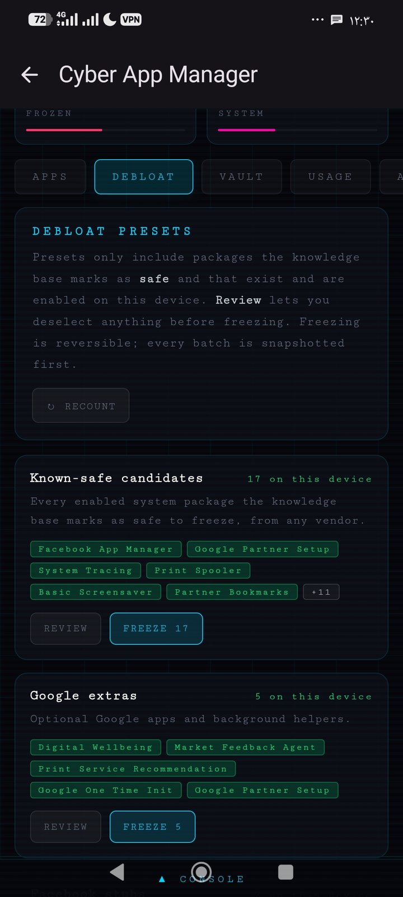
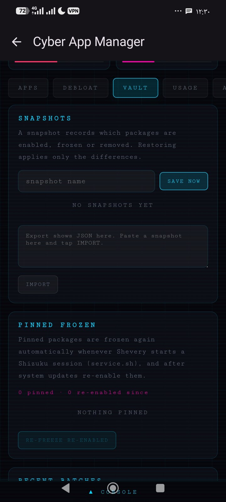
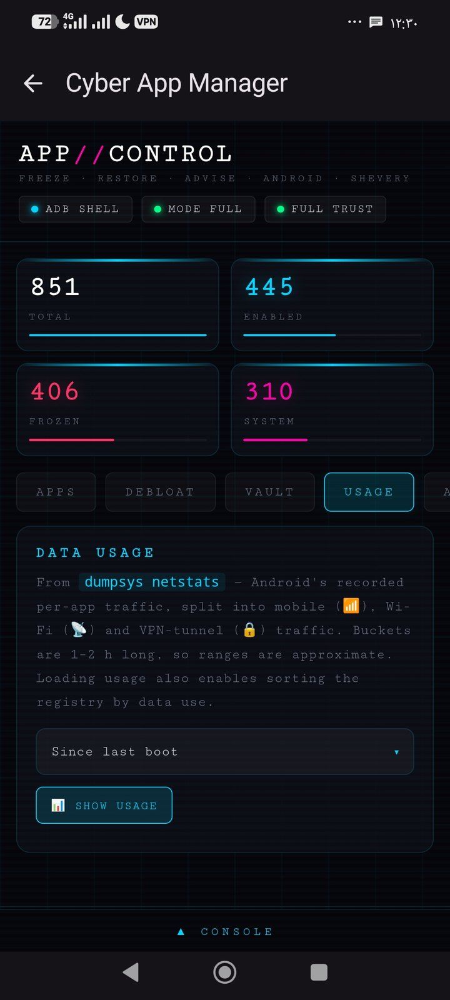
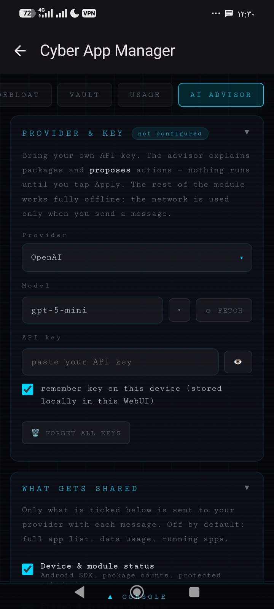
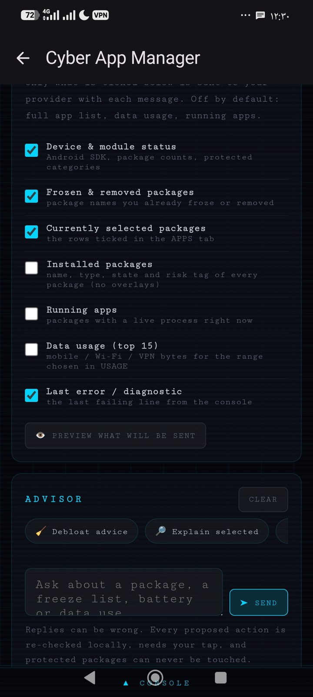

# Cyber App Manager

**A cyberpunk-themed Android package manager — built as a [Shevery](https://github.com/HmnDev-Tech/shevery) ADB module.**


Freeze, restore, remove and inspect any package — system or user — without root, using `pm` and `am` through Shizuku/ADB. Snapshots, undo, pinned auto re-freeze, debloat presets built from a community knowledge base, per-app details (permissions, background limits, standby bucket), a data-usage view, and an optional AI advisor that explains packages and proposes changes you approve one by one.

<table>
  <tr>
    <td width="33%"></td>
    <td width="33%"></td>
    <td width="33%"></td>
  </tr>
  <tr>
    <td width="33%"></td>
    <td width="33%"></td>
    <td width="33%"></td>
  </tr>
</table>

## Features

- 🧊 **Freeze / unfreeze / force-stop / remove / restore** any package for the current user, with a live registry (search, filters, risk tag, sort)
- 📚 **Knowledge base** of common Android, Google, Xiaomi/HyperOS, Samsung and OEM packages — friendly names, categories and a safe/caution/core risk tag, plus heuristics for anything not in the table
- 🧹 **Debloat presets** (Google extras, Facebook stubs, telemetry, Xiaomi extras, Samsung extras, AOSP leftovers, and a knowledge-base-wide "known-safe" list) — review before freezing, or freeze in one tap
- 💾 **Snapshots & undo** — save the full package state, diff it against now, restore just the differences, export/import as JSON; every batch is auto-snapshotted and the last 10 batches can be undone from a toast or the Vault tab
- 📌 **Pinned freeze** — pin a package so it is frozen again automatically whenever Shevery starts a session (`service.sh`) or after it gets re-enabled by an update
- 🔎 **Per-app detail sheet** — version, installer, install/update dates, runtime permissions (grant/revoke), background-activity restriction, app standby bucket
- 📊 **Data usage** — since boot, last 24 h, all recorded history or since the last full charge, split into mobile / Wi-Fi / VPN-tunnel traffic, aggregated on-device from `dumpsys netstats`
- 🤖 **Optional AI advisor** — bring your own API key (OpenAI, Anthropic Claude, Google Gemini, DeepSeek, Mistral, xAI, or any OpenAI-compatible/local endpoint); explains packages and proposes actions you approve one by one
- 🛡️ **Guarded by design** — core Android/Google components, resource overlays and the current launcher, keyboard, dialer and SMS app are detected live and can never be frozen, stopped, removed or have permissions touched, even by the AI or an imported snapshot
- 🖥️ **Shell bridge console** — every command sent to the device, with copy/clear

## Requirements

- [Shevery](https://github.com/HmnDev-Tech/shevery) with Shizuku (ADB or root mode)
- Android 8+ (uses `pm disable-user` / `pm enable`, standard since Android 8)
- Root is not required for any feature of this module

## Installation

1. Download the latest release ZIP.
2. In Shevery, open **ADB Modules → Install ZIP** and select the file.
3. Set the module access mode to **Full access**, or enable **WebUI shell bridge** in Custom mode.
4. Open the module's WebUI.

## Usage

| Tab | Purpose |
|---|---|
| **Apps** | Search, filter and sort the full package registry; select packages and freeze, unfreeze, force-stop, remove, restore or pin them in a batch |
| **Debloat** | Ready-made presets built from the knowledge base; review the selection before freezing |
| **Vault** | Snapshots (save/diff/restore/export/import), pinned packages, recent undoable batches, and module settings |
| **Usage** | Per-app data usage for a chosen range, split into mobile / Wi-Fi / VPN traffic |
| **AI Advisor** | Chat with your provider of choice about your packages (optional) |

Tapping the **i** button on any package opens its detail sheet: version, installer, permissions, background limits and standby bucket. The **AI** button asks the advisor about that specific package.

The module also ships a quick action (`action.sh`, tap the module card → Action) that prints a status summary and re-applies pinned freezes without opening the WebUI.

## AI Advisor

The advisor is disabled until you add your own API key in the **AI Advisor** tab. Nothing is sent to any provider before you send a message.

- **Providers** — OpenAI, Anthropic (Claude), Google Gemini, DeepSeek, Mistral, xAI, and a *Custom* option for any OpenAI-compatible base URL (Ollama, LM Studio, OpenRouter, your own proxy). **Fetch** lists the models available to your key.
- **You control what is shared** — device status, frozen/removed packages, the current selection and the last diagnostic are shared by default; the full package list, running apps and data usage are opt-in. **Preview what will be sent** shows the exact context text.
- **Proposals, not commands** — the advisor can suggest freezing, unfreezing, force-stopping, removing, restoring, pinning, restricting background activity, or saving a note about a package. Nothing runs until you tap **Apply**, and destructive actions still ask for confirmation (typed confirmation for removal).
- **Local validation** — every proposal is re-checked before it can run: the package must exist and not be core, an overlay, or the current launcher/keyboard/dialer/SMS app. Notes are clearly labelled as unverified AI output in the detail sheet.
- **Key storage** — keys are kept in this WebUI's local storage only. Untick *remember key* to keep a key for the current session, or use *Forget all keys* to remove them.

Requests are sent directly from the WebUI to the provider you choose. OpenAI, Anthropic and Gemini accept direct browser calls; for providers that do not, use the *Custom* option with a proxy.

> **Internet access:** Shevery blocks network access inside module WebUIs by default. To use the advisor, long-press the Cyber App Manager card in Shevery and tap **Trust**, then reopen the module.

## Safety model

| Layer | Reversibility | Gate |
|---|---|---|
| Freeze / unfreeze | Instant toggle, auto-snapshotted | confirmation (destructive-style for freeze) |
| Force-stop | Instant | none |
| Remove (system app) | Recoverable with Restore | confirmation |
| Remove (user app) | Not reversible — data is lost | typed confirmation |
| Permission grant/revoke, background restriction, standby bucket | Instant toggle from the detail sheet | guard check |
| AI-proposed actions | Same as above | explicit **Apply** tap + local validation, on top of the manager's own confirmations |

Core Android/Google components and resource overlays are refused by a static list; the current launcher, keyboard, default dialer and default SMS app are detected live on every scan and refused dynamically, so the check still holds after you change any of them.

## Repository layout

```
module.prop         Module metadata
action.sh            Status summary + re-applies pinned freezes
service.sh           Re-applies pinned freezes once per Shizuku session
appctl.sh            Single-package control for scripting (freeze/unfreeze/force-stop/remove/restore/clear-data)
snapshot.sh          Snapshot save/list/show/diff/restore/delete from the command line
lib.sh               Shared shell helpers (guard, current_states, cam_op, enforce_pinned)
webui/index.html     Interface
webui/style.css      Theme
webui/script.js      Core engine: bridge, registry, guard, ops, snapshots, pins, usage, detail sheet
webui/kb.js          Package knowledge base and debloat presets
webui/ai.js          Optional AI advisor
docs/screenshots/    Images used in this README
```

Snapshots, pins and logs are stored at `/data/local/tmp/cyber-app-manager` on the device, shared between the WebUI and the shell scripts.

## Contributing

Issues and pull requests are welcome, including additions to the package knowledge base. Please keep new destructive actions behind a confirmation, keep the guard checks in `lib.sh` and `webui/script.js` in sync, and never allow a core package, overlay, or the live launcher/keyboard/dialer/SMS app to be frozen, stopped or removed.

## Disclaimer

Freezing or removing the wrong package can break features of your phone, including ones this module cannot detect (a poorly documented OEM dependency, for instance). Risk tags come from a community knowledge base and heuristics, not a guarantee. Snapshots make this reversible for anything the module itself changed — use them.

## License

MIT — see [LICENSE](LICENSE).
